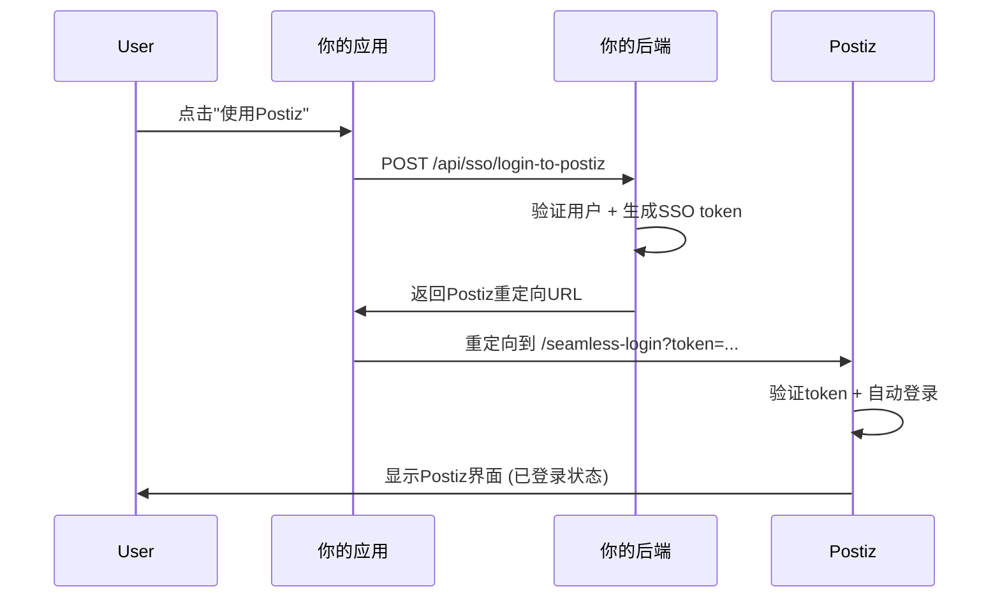

# 外部产品 SSO 集成指南

## 概述
如果你有一个外部的 Node.js 后端项目，想要将用户无缝登录到 Postiz，你需要生成一个 SSO token 并重定向用户。

## 集成步骤

### 1. 生成 SSO Token
在你的 Node.js 后端中，你需要生成一个包含用户信息的 JWT token：

```javascript
// 安装依赖: npm install jsonwebtoken
const jwt = require('jsonwebtoken');

// SSO 密钥 (生产环境应该与 Postiz 共享)
const SSO_SECRET = 'your-shared-sso-secret-key';

// 生成 SSO token 的函数
function generateSsoToken(userInfo) {
  const payload = {
    // 必需字段
    userId: userInfo.id,
    email: userInfo.email,
    name: userInfo.name,
    
    // 可选字段
    avatar: userInfo.avatar || null,
    organizationId: userInfo.organizationId || null,
    productKey: 'your-product-key', // 你的产品标识
    
    // Token 元数据
    iss: 'your-product-name',      // 签发者
    aud: 'postiz',                 // 接收者
    exp: Math.floor(Date.now() / 1000) + (60 * 15), // 15分钟过期
    iat: Math.floor(Date.now() / 1000), // 签发时间
  };

  return jwt.sign(payload, SSO_SECRET, { algorithm: 'HS256' });
}
```

### 2. 创建登录端点
在你的后端创建一个端点来处理 SSO 登录：

```javascript
const express = require('express');
const app = express();

// SSO 登录路由
app.post('/api/sso/login-to-postiz', async (req, res) => {
  try {
    const { userId } = req.body;
    
    // 1. 验证用户身份 (根据你的业务逻辑)
    const user = await getUserById(userId); // 你的用户查询逻辑
    
    if (!user) {
      return res.status(404).json({ error: 'User not found' });
    }
    
    // 2. 生成 SSO token
    const ssoToken = generateSsoToken({
      id: user.id,
      email: user.email,
      name: user.name,
      avatar: user.avatar,
      organizationId: user.organizationId
    });
    
    // 3. 构建 Postiz 登录 URL
    const postizUrl = new URL('http://localhost:4200/seamless-login');
    postizUrl.searchParams.set('token', ssoToken);
    
    // 可选参数
    postizUrl.searchParams.set('redirect_url', '/launches'); // 登录后跳转页面
    postizUrl.searchParams.set('state', req.body.state || ''); // 防CSRF状态
    
    // 4. 返回重定向URL
    res.json({
      success: true,
      redirectUrl: postizUrl.toString(),
      message: 'Redirect user to this URL for seamless login'
    });
    
  } catch (error) {
    console.error('SSO login error:', error);
    res.status(500).json({ error: 'SSO login failed' });
  }
});
```

### 3. 前端集成示例
在你的前端 (React/Vue/原生JS) 中调用SSO登录：

```javascript
// React 示例
async function loginToPostiz(userId) {
  try {
    const response = await fetch('/api/sso/login-to-postiz', {
      method: 'POST',
      headers: {
        'Content-Type': 'application/json',
        'Authorization': `Bearer ${yourAuthToken}` // 你的认证token
      },
      body: JSON.stringify({ userId })
    });
    
    const data = await response.json();
    
    if (data.success) {
      // 重定向用户到 Postiz
      window.open(data.redirectUrl, '_blank'); // 新窗口打开
      // 或者
      window.location.href = data.redirectUrl; // 当前窗口跳转
    }
  } catch (error) {
    console.error('SSO login failed:', error);
  }
}

// 使用示例
<button onClick={() => loginToPostiz(currentUser.id)}>
  使用 Postiz 发布内容
</button>
```

## 参数说明

### 必需参数
- **token** - JWT格式的SSO token，包含用户信息

### 可选参数
- **redirect_url** - 登录成功后的跳转页面 (默认: `/launches`)
- **state** - 防CSRF攻击的状态参数
- **challenge** - 额外的安全挑战码

### Token Payload 结构
```javascript
{
  "userId": "user-unique-id",        // 必需
  "email": "user@example.com",       // 必需  
  "name": "User Name",               // 必需
  "avatar": "https://...",           // 可选
  "organizationId": "org-id",        // 可选
  "productKey": "your-product",      // 推荐
  "iss": "your-product-name",        // 签发者
  "aud": "postiz",                   // 接收者
  "exp": 1234567890,                 // 过期时间
  "iat": 1234567890                  // 签发时间
}
```

## 完整的集成流程



## 安全建议

1. **共享密钥** - 确保SSO_SECRET与Postiz后端一致
2. **Token过期** - 设置较短的过期时间 (5-15分钟)
3. **HTTPS** - 生产环境必须使用HTTPS
4. **验证签发者** - Postiz应验证token的iss字段
5. **IP白名单** - 可选择限制调用来源IP

## 测试
你可以使用以下测试token来验证集成：
```
eyJhbGciOiJIUzI1NiIsInR5cCI6IkpXVCJ9.eyJ1c2VySWQiOiJ0ZXN0LXVzZXIiLCJlbWFpbCI6InRlc3RAdGVzdC5jb20iLCJuYW1lIjoiVGVzdCBVc2VyIiwicHJvZHVjdEtleSI6InlvdXItcHJvZHVjdCIsImlzcyI6InlvdXItcHJvZHVjdCIsImF1ZCI6InBvc3RpeiIsImV4cCI6OTk5OTk5OTk5OSwiaWF0IjoxNjAwMDAwMDAwfQ.example
```

测试URL:
```
http://localhost:4200/seamless-login?token=YOUR_GENERATED_TOKEN
```

需要更多具体的实现帮助吗？